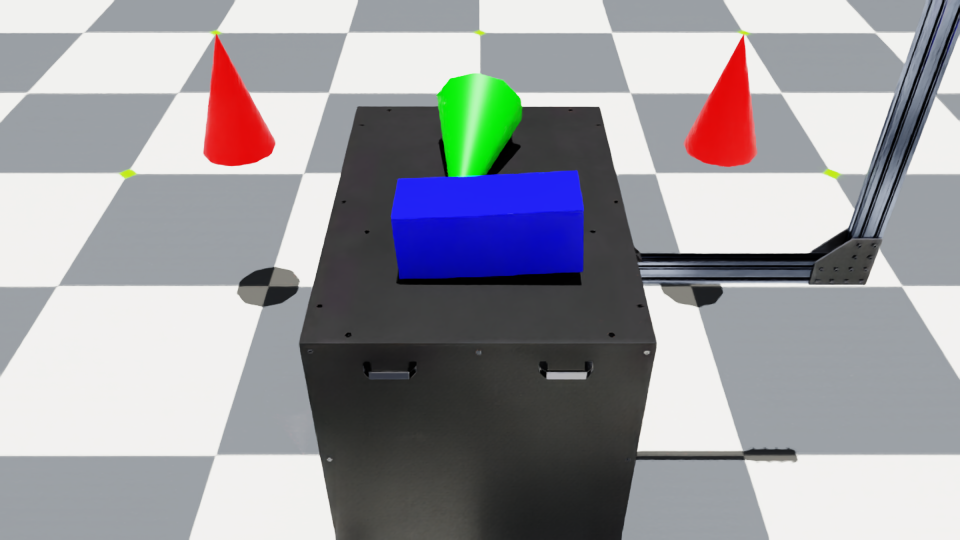
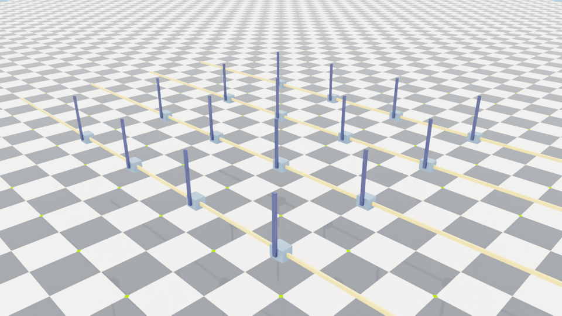
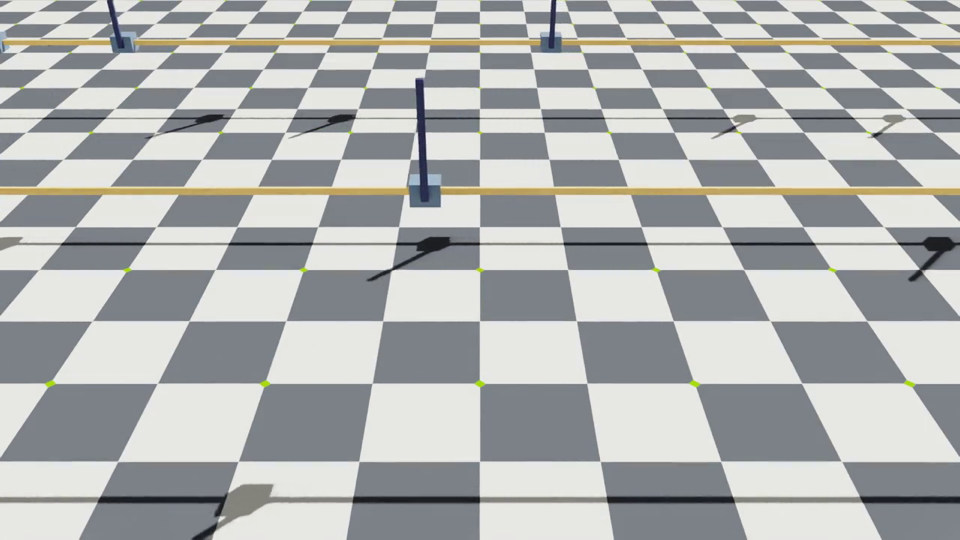

# Isaac Lab 3.0 핵심 튜토리얼 정리 (How-to Guides)

Isaac Lab 3.0 공식 문서의 How-to Guides 가운데 입문 순서에 해당하는 13개를 한국어로 정리했다.
가이드마다 목표, 핵심 클래스와 설정 필드, 실제로 돌려 본 실행 명령과 결과, 그리고 직접 바꿔 볼 만한 파라미터를 담았다.

- 문서 기준: `release/3.0.0` 브랜치 (docs commit `5aaabae`)
- 검증 환경: RTX 5090, driver 595.84 서버 (Linux, 화면 없음), Isaac Lab `release/3.0.0` (commit `44e290c`), `uv` 0.12
- 설치된 extra: `isaacsim`, `video`
- 모든 명령은 Isaac Lab 저장소 루트(`~/IsaacLab`)에서 실행했다.

> 원본 튜토리얼 파일을 직접 고치지 말고, 실험할 때는 복사본을 만들어 쓰는 편이 좋다.
> 예: `cp scripts/tutorials/02_scene/create_scene.py my_create_scene.py` 후 `uv run ... python my_create_scene.py`

---

## 0. 시작 전에: 3.0에서 달라진 점과 공통 규칙

### 공통 실행 형태

```bash
cd ~/IsaacLab
export PATH=$HOME/.local/bin:$PATH
export OMNI_KIT_ACCEPT_EULA=YES          # 없으면 EULA 입력을 기다리다 종료된다 (isaaclab train --help 도 마찬가지)

# Kit(Isaac Sim) 기반 튜토리얼 스크립트
uv run --extra isaacsim --extra video python scripts/tutorials/<폴더>/<스크립트>.py [옵션]

# 문서에 나오는 isaaclab -p 형태도 똑같이 동작한다 (검증됨)
uv run --extra isaacsim --extra video isaaclab -p scripts/tutorials/01_assets/run_rigid_object.py
```

튜토리얼 스크립트는 `while simulation_app.is_running():` 루프를 끝없이 돈다.
화면 없는 서버에서는 `timeout 120 ...`으로 감싸서 실행했고, 정상 로그가 나온 뒤 exit code 124(timeout)로 끝나면 성공으로 봤다.

### 3.0에서 헷갈리기 쉬운 점 (직접 겪은 것 위주)

| 항목 | 2.x 까지 | 3.0 |
|---|---|---|
| 헤드리스 실행 | `--headless` | 옵션 없음. `--viz`(= `--visualizer`)를 주지 않으면 헤드리스 |
| 뷰어 켜기 | 기본 GUI | `--viz kit` (그 밖에 `newton`, `rerun`, `viser`. 쉼표로 여러 개) |
| 뷰어 강제 끄기 | - | `--viz none` (스크립트나 태스크가 기본 visualizer를 지정한 경우에 필요) |
| 카메라 센서 | `--enable_cameras` | 옵션 없음. `--viz kit` 또는 `--experience isaaclab.python.headless.rendering.kit` (아래 12절) |
| 쿼터니언 순서 | `(w, x, y, z)` | `(x, y, z, w)`. 예: 단위 회전은 `(0, 0, 0, 1)` |
| 데이터 접근 | `robot.data.joint_pos` (torch.Tensor) | `robot.data.joint_pos.torch` (`ProxyArray`의 `.torch`) |
| 상태 쓰기 | `write_root_state_to_sim(...)` | `write_root_pose_to_sim_index(...)`, `write_root_velocity_to_sim_index(...)` 처럼 pose와 velocity를 나눠 쓴다 |
| 학습 실행 | `python scripts/reinforcement_learning/<lib>/train.py` | `isaaclab train --rl_library <lib> --task ...` |
| 학습 기본 물리엔진 | PhysX | 태스크 preset 기본값이 Newton(`newton_mjwarp`). PhysX를 쓰려면 `physics=isaacsim_physx` |
| 태스크 이름 | `Isaac-Cartpole-v0` | `Isaac-Cartpole`, `Isaac-Cartpole-Direct` (`-v0` 없음) |

- 선택 extra(`sb3`, `rl-games`, `tetrahedralization` 등)가 설치되어 있지 않으면 `uv run --extra <이름>`으로 venv에 설치하거나, 설치 환경을 건드리지 않으려면 `uv run --with <패키지>`로 임시 환경에 얹어 실행하면 된다. 이 문서에서는 설치 환경을 바꾸지 않으려고 `--with`를 썼다.
- `isaaclab train`/`play`의 로그는 **현재 작업 디렉터리** 아래 `logs/<라이브러리>/...`에 쌓인다.

---

## 1. 빈 장면 만들기: `create_empty`

- 문서: <https://isaac-sim.github.io/IsaacLab/release/3.0.0/source/how-to/create_empty.html>
- 스크립트: [`scripts/tutorials/00_sim/create_empty.py`](https://github.com/isaac-sim/IsaacLab/blob/release/3.0.0/scripts/tutorials/00_sim/create_empty.py)

**목표.** 독립 실행 Python 스크립트에서 시뮬레이터를 띄우고, 빈 stage를 한 스텝씩 진행시키는 가장 작은 뼈대를 익힌다.

**핵심 개념**
- `AppLauncher`: Isaac Sim(`SimulationApp`)을 CLI 인자로 띄워 준다. **Isaac Sim 모듈은 앱이 뜬 뒤에만 import할 수 있으므로** `AppLauncher`를 먼저 만들고 나머지를 import한다.
- `SimulationCfg` / `SimulationContext`: 물리 dt, gravity, device 등을 담는 설정과, play/step/reset을 맡는 컨텍스트.

```python
parser = argparse.ArgumentParser(description="Tutorial on creating an empty stage.")
AppLauncher.add_app_launcher_args(parser)      # --device, --viz 등 공통 인자 추가
args_cli = parser.parse_args()
app_launcher = AppLauncher(args_cli)
simulation_app = app_launcher.app
# ---- 여기부터 isaaclab.sim 등 import 가능 ----
sim_cfg = SimulationCfg(dt=0.01)               # 물리/렌더 스텝 0.01 s
sim = SimulationContext(sim_cfg)
sim.set_camera_view([2.5, 2.5, 2.5], [0.0, 0.0, 0.0])   # eye, target
sim.reset()                                    # 물리 핸들 초기화 (반드시 step 전에)
while simulation_app.is_running():
    sim.step()
```

**실행** (검증됨)

```bash
timeout 120 uv run --extra isaacsim --extra video python scripts/tutorials/00_sim/create_empty.py
# 화면이 있는 PC에서 창을 보려면: ... create_empty.py --viz kit
```

**관찰.** Warp가 `cuda:0 : NVIDIA GeForce RTX 5090 (31 GiB, sm_120)`을 인식하고 `[INFO]: Setup complete...`를 출력한 뒤 120 s 동안 스텝을 돌다가 timeout(124)으로 끝났다. 빈 장면이라 그 밖의 출력은 없다.

**바꿔 볼 것**
- `SimulationCfg(dt=0.01)`을 `dt=0.005`로 바꾸면 물리 스텝이 2배 촘촘해진다. 같은 시간 동안 도는 step 수를 세어 비교해 보자.
- `SimulationCfg(dt=0.01, gravity=(0.0, 0.0, -1.62))`: 달 중력. 빈 장면에서는 보이는 변화가 없으니 2절의 강체 원뿔을 넣은 뒤 떨어지는 속도를 비교한다.
- `sim.set_camera_view(eye, target)` 값을 바꿔 `--viz kit`에서 시점이 어떻게 바뀌는지 확인한다.
- `--device cpu`로 CPU 물리를 돌려 본다.

---

## 2. prim 배치하기: `spawn_prims`

- 문서: <https://isaac-sim.github.io/IsaacLab/release/3.0.0/source/how-to/spawn_prims.html>
- 스크립트: [`scripts/tutorials/00_sim/spawn_prims.py`](https://github.com/isaac-sim/IsaacLab/blob/release/3.0.0/scripts/tutorials/00_sim/spawn_prims.py)

**목표.** 설정 클래스(`*Cfg`)와 그 `func`으로 지면, 조명, 기본 도형, 강체, 변형체, USD 파일을 stage에 올린다.

**핵심 개념**
- USD의 prim, prim path(`/World/Objects/Cone1`), Xform(변환만 가진 묶음 prim).
- 모든 spawner는 `cfg.func(prim_path, cfg, translation=..., orientation=...)` 형태로 호출한다.
- 같은 모양이라도 `rigid_props`, `mass_props`, `collision_props`를 주면 물리 강체가 되고, 주지 않으면 보이기만 하는 정적 도형이다.

```python
cfg_light_distant = sim_utils.DistantLightCfg(intensity=3000.0, color=(0.75, 0.75, 0.75))
cfg_light_distant.func("/World/lightDistant", cfg_light_distant, translation=(1, 0, 10))

sim_utils.create_prim("/World/Objects", "Xform")            # 묶음용 Xform
cfg_cone_rigid = sim_utils.ConeCfg(
    radius=0.15, height=0.5,
    rigid_props=sim_utils.RigidBodyPropertiesCfg(),
    mass_props=sim_utils.MassPropertiesCfg(mass=1.0),
    collision_props=sim_utils.CollisionPropertiesCfg(),
    visual_material=sim_utils.PreviewSurfaceCfg(diffuse_color=(0.0, 1.0, 0.0)),
)
cfg_cone_rigid.func("/World/Objects/ConeRigid", cfg_cone_rigid,
                    translation=(-0.2, 0.0, 2.0), orientation=(0.5, 0.0, 0.5, 0.0))  # XYZW
```

**실행**

```bash
# 문서 그대로 (tetrahedralization extra 미설치 상태)
timeout 180 uv run --extra isaacsim --extra video python scripts/tutorials/00_sim/spawn_prims.py
```
(실패: 4 s 만에 `ModuleNotFoundError: No module named 'pytetwild'`. 파란 변형체 상자 `MeshCuboidCfg(deformable_props=...)`를 사면체 메시로 바꾸려면 `tetrahedralization` extra가 필요하다.)

```bash
# 방법 1: 문서 권장. venv에 extra를 설치한다
timeout 180 uv run --extra isaacsim --extra video --extra tetrahedralization python scripts/tutorials/00_sim/spawn_prims.py
# 방법 2: 설치 환경을 건드리지 않는 임시 의존성 (검증됨)
timeout 180 uv run --extra isaacsim --extra video --with "pytetwild[all]>=0.3.0,<0.4" \
    python scripts/tutorials/00_sim/spawn_prims.py
```

**관찰.** 방법 2로 실행하자 첫 실행(임시 환경 구성 포함) 28 s 뒤 `Setup complete...`가 출력됐고, 180 s timeout까지 정상으로 돌았다. 아래는 같은 장면을 스크립트의 카메라 시점(`eye=[2.0, 0.0, 2.5]`, `target=[-0.5, 0.0, 0.5]`)에서 60 스텝 진행한 뒤 렌더한 것이다. 빨간 원뿔 두 개는 물리가 없어 공중에 떠 있고, 초록 원뿔(강체)과 파란 상자(변형체)는 테이블 위에 떨어져 있다.



**바꿔 볼 것**
- `cfg_cone.func("/World/Objects/Cone1", cfg_cone, translation=(-1.0, 1.0, 1.0))`의 `translation`을 바꿔 물체 위치를 옮긴다.
- `ConeRigid`의 `orientation=(0.5, 0.0, 0.5, 0.0)`을 `(0.0, 0.0, 0.0, 1.0)`(회전 없음)으로 바꾸고 떨어지는 모습을 비교한다. 3.0은 **XYZW** 순서라는 점에 주의.
- `MassPropertiesCfg(mass=1.0)`을 `10.0`으로 바꿔 변형체 상자와 부딪칠 때 차이를 본다.
- `DistantLightCfg(intensity=3000.0)`을 낮추거나 `color`를 바꿔 조명 효과를 확인한다(`--viz kit` 필요).

---

## 3. AppLauncher 자세히 보기: `launch_app`

- 문서: <https://isaac-sim.github.io/IsaacLab/release/3.0.0/source/how-to/launch_app.html>
- 스크립트: [`scripts/tutorials/00_sim/launch_app.py`](https://github.com/isaac-sim/IsaacLab/blob/release/3.0.0/scripts/tutorials/00_sim/launch_app.py)

**목표.** 스크립트 고유 인자(`--size`)와 `AppLauncher` 공통 인자, `SimulationApp`으로 넘어가는 인자(`--width`, `--height`)를 하나의 argparse로 합치는 법을 익힌다.

**핵심 개념**
- `AppLauncher.add_app_launcher_args(parser)`는 기존 parser에 공통 인자 그룹을 덧붙인다.
- 3.0의 공통 인자: `--livestream {0,1,2}`, `--xr`, `--device`, `--visualizer/--viz`, `--verbose`, `--info`, `--experience`, `--deterministic`, `--kit_args`, `--anim_recording_*`, `--max_visible_envs`. `--headless`와 `--enable_cameras`는 **없다**.

```python
parser.add_argument("--size", type=float, default=1.0, help="Side-length of cuboid")
parser.add_argument("--width", type=int, default=1280, ...)
AppLauncher.add_app_launcher_args(parser)
...
cfg_cuboid = sim_utils.CuboidCfg(size=[args_cli.size] * 3, ...)
cfg_cuboid.func("/World/Object", cfg_cuboid, translation=(0.0, 0.0, args_cli.size / 2))
```

**실행**

```bash
uv run --extra isaacsim --extra video python scripts/tutorials/00_sim/launch_app.py --help           # (검증됨)
timeout 90 uv run --extra isaacsim --extra video python scripts/tutorials/00_sim/launch_app.py --size 0.5   # (검증됨)
```

**관찰.** `--help`는 앱을 띄우지 않고 즉시(0 s) 끝나며, 위 공통 인자 목록이 `app_launcher arguments` 그룹으로 나온다. `--size 0.5`는 4 s 만에 `Setup complete...`가 나왔고 90 s 동안 정상으로 돌았다.

**바꿔 볼 것**
- `--size 0.5`, `--size 2.0`: 한 변 길이. 바닥에 닿도록 `translation`의 z가 `size/2`로 따라 바뀐다.
- `--width 640 --height 480`: 뷰포트와 렌더 해상도.
- `--device cpu`: CPU로 물리를 돌린다.
- `--help` 출력에서 `--size`가 스크립트 인자, `--device`/`--viz`가 AppLauncher 인자 그룹으로 나뉘어 나오는 것을 확인한다.

---

## 4. 강체 다루기: `run_rigid_object`

- 문서: <https://isaac-sim.github.io/IsaacLab/release/3.0.0/source/how-to/run_rigid_object.html>
- 스크립트: [`scripts/tutorials/01_assets/run_rigid_object.py`](https://github.com/isaac-sim/IsaacLab/blob/release/3.0.0/scripts/tutorials/01_assets/run_rigid_object.py)

**목표.** `RigidObject`로 여러 개의 강체 원뿔을 한 번에 만들고, 상태를 리셋하고, 스텝을 진행하고, 갱신된 상태를 읽는다.

**핵심 개념**
- `RigidObjectCfg(prim_path="/World/Origin.*/Cone", spawn=..., init_state=...)`: 정규식 prim path 하나로 `Origin0~3` 아래 원뿔 4개를 만들고 하나의 텐서 뷰로 다룬다.
- 루프 패턴: `write_data_to_sim()` → `sim.step()` → `update(dt)`.
- 루트 상태는 **world 좌표**로 써야 한다. 그래서 기본 pose에 각 원점(`origins`)을 더한다.

```python
cone_cfg = RigidObjectCfg(
    prim_path="/World/Origin.*/Cone",
    spawn=sim_utils.ConeCfg(radius=0.1, height=0.2,
        rigid_props=sim_utils.UsdPhysicsRigidBodyCfg(),
        mass_props=sim_utils.MassCfg(mass=1.0),
        collision_props=sim_utils.UsdPhysicsCollisionCfg(), ...),
    init_state=RigidObjectCfg.InitialStateCfg(),        # pos=(0,0,0), rot=(0,0,0,1)
)
...
if count % 250 == 0:                                    # 250 스텝마다 리셋
    root_pose = cone_object.data.default_root_pose.torch.clone()
    root_pose[:, :3] += origins
    root_pose[:, :3] += math_utils.sample_cylinder(radius=0.1, h_range=(0.25, 0.5), ...)
    cone_object.write_root_pose_to_sim_index(root_pose=root_pose)
    cone_object.write_root_velocity_to_sim_index(root_velocity=cone_object.data.default_root_vel.torch.clone())
    cone_object.reset()
```

**실행** (검증됨, 두 형태 모두)

```bash
timeout 90 uv run --extra isaacsim --extra video python scripts/tutorials/01_assets/run_rigid_object.py
timeout 45 uv run --extra isaacsim --extra video isaaclab -p scripts/tutorials/01_assets/run_rigid_object.py   # 문서 형태
```

**관찰.** `Setup complete`까지 3 s. 50 스텝마다 4개 원뿔의 world 위치가 찍히는데, 떨어진 뒤에는 z가 모두 `0.1000`(높이 0.2 원뿔이 바닥에 놓인 높이)으로 수렴했다. 뷰어 없이 돌리니 매우 빨라서 90 s 동안 리셋이 428번(약 10만 스텝) 일어났다.

**바꿔 볼 것**
- `origins = [[0.25, 0.25, 0.0], ...]`의 좌표를 바꾸거나 원소를 늘려 원뿔 개수와 위치를 바꾼다(`/World/Origin{i}`가 늘어난다).
- `sample_cylinder(radius=0.1, h_range=(0.25, 0.5))`의 `h_range`를 `(1.0, 2.0)`으로 올려 더 높은 곳에서 떨어뜨린다.
- `root_vel`에 초기 속도를 넣어 본다. 예: `root_vel[:, 2] = 3.0`이면 위로 튀어 오른다(선속도 3개 + 각속도 3개).
- `SimulationCfg(device=..., gravity=(0.0, 0.0, -1.62))`로 중력을 바꾸고 로그의 z가 수렴하는 속도를 비교한다.

---

## 5. 관절 로봇 다루기: `run_articulation`

- 문서: <https://isaac-sim.github.io/IsaacLab/release/3.0.0/source/how-to/run_articulation.html>
- 스크립트: [`scripts/tutorials/01_assets/run_articulation.py`](https://github.com/isaac-sim/IsaacLab/blob/release/3.0.0/scripts/tutorials/01_assets/run_articulation.py)

**목표.** 미리 정의된 `CARTPOLE_CFG`로 cart-pole 2대를 만들고, 루트 상태와 관절 상태를 리셋하고, 관절에 힘(effort)을 넣는다.

**핵심 개념**
- `ArticulationCfg`: USD 경로, `init_state`(루트 `pos`/`rot`, `joint_pos`/`joint_vel`), `actuators`를 담는다. cart-pole의 초기 상태는 `pos=(0.0, 0.0, 2.0)`, `joint_pos={"slider_to_cart": 0.0, "cart_to_pole": 0.0}`이다.
- Articulation은 루트 상태에 더해 **관절 상태**(위치, 속도)가 있다.
- effort 제어가 먹히려면 해당 관절 actuator의 stiffness/damping이 0이어야 한다(`CARTPOLE_CFG`에 이미 그렇게 설정되어 있다).

```python
cartpole_cfg = CARTPOLE_CFG.copy()
cartpole_cfg.prim_path = "/World/Origin.*/Robot"
cartpole = Articulation(cfg=cartpole_cfg)
...
joint_pos, joint_vel = robot.data.default_joint_pos.torch.clone(), robot.data.default_joint_vel.torch.clone()
joint_pos += torch.rand_like(joint_pos) * 0.1                   # 초기 관절각에 잡음
robot.write_joint_position_to_sim_index(position=joint_pos)
robot.write_joint_velocity_to_sim_index(velocity=joint_vel)
robot.reset()
...
efforts = torch.randn_like(robot.data.joint_pos.torch) * 5.0      # 무작위 힘
robot.actuators.target_command.set_effort_index(value=efforts)
robot.write_data_to_sim()
```

**실행** (검증됨)

```bash
timeout 90 uv run --extra isaacsim --extra video python scripts/tutorials/01_assets/run_articulation.py
```

**관찰.** `Setup complete`까지 4 s, 500 스텝마다 `[INFO]: Resetting robot state...`가 찍혀 90 s 동안 237번 리셋됐다. 원격 에셋(cartpole USD)은 처음 한 번 받은 뒤 로컬 캐시에서 읽는다는 경고가 나온다.

**바꿔 볼 것**
- `joint_pos += torch.rand_like(joint_pos) * 0.1`의 `0.1`을 `1.0`으로 키우면 pole이 크게 기운 상태에서 시작한다.
- `efforts = ... * 5.0`을 `0.0`으로 바꾸면 초기 잡음만으로 pole이 넘어지는 모습을, `50.0`으로 바꾸면 카트가 격하게 움직이는 모습을 볼 수 있다.
- `cartpole_cfg.init_state.pos = (0.0, 0.0, 3.0)`처럼 복사한 cfg의 초기 루트 위치를 바꾼다.
- `sim.set_camera_view([2.5, 0.0, 4.0], [0.0, 0.0, 2.0])`의 eye를 `[0.0, -6.0, 3.0]` 등으로 바꿔 옆에서 본다(`--viz kit`).

---

## 6. InteractiveScene 쓰기: `create_scene`

- 문서: <https://isaac-sim.github.io/IsaacLab/release/3.0.0/source/how-to/create_scene.html>
- 스크립트: [`scripts/tutorials/02_scene/create_scene.py`](https://github.com/isaac-sim/IsaacLab/blob/release/3.0.0/scripts/tutorials/02_scene/create_scene.py)

**목표.** 5절의 `design_scene()`을 선언형 `InteractiveSceneCfg`로 바꿔, 환경 N개를 자동으로 복제하고 한꺼번에 관리한다.

**핵심 개념**
- `InteractiveSceneCfg`의 클래스 변수 이름(`ground`, `dome_light`, `cartpole`)이 곧 `scene["cartpole"]`의 key가 된다.
- 상호작용하지 않는 prim(지면, 조명)은 `AssetBaseCfg`, 로봇은 `ArticulationCfg`.
- `{ENV_REGEX_NS}`는 `/World/envs/env_.*`로 바뀌어 환경마다 복제된다. 복제 대상이 아닌 것은 `/World/...` 절대 경로를 쓴다.
- `num_envs`, `env_spacing`으로 격자 배치가 정해지고, 각 환경의 원점은 `scene.env_origins`로 얻는다.

```python
@configclass
class CartpoleSceneCfg(InteractiveSceneCfg):
    ground = AssetBaseCfg(prim_path="/World/defaultGroundPlane", spawn=sim_utils.GroundPlaneCfg())
    dome_light = AssetBaseCfg(prim_path="/World/Light",
                              spawn=sim_utils.DomeLightCfg(intensity=3000.0, color=(0.75, 0.75, 0.75)))
    cartpole: ArticulationCfg = CARTPOLE_CFG.replace(prim_path="{ENV_REGEX_NS}/Robot")

scene_cfg = CartpoleSceneCfg(num_envs=args_cli.num_envs, env_spacing=2.0)
scene = InteractiveScene(scene_cfg)
...
root_pose[:, :3] += scene.env_origins
scene.write_data_to_sim(); sim.step(); scene.update(sim_dt)
```

**실행** (검증됨)

```bash
timeout 90 uv run --extra isaacsim --extra video python scripts/tutorials/02_scene/create_scene.py --num_envs 32
```

**관찰.** 32개 환경에서 `Setup complete`까지 5 s, 90 s 동안 리셋 221번. 3.0에서는 이 스크립트가 쓰는 `robot.set_joint_effort_target_index(...)`에 대해 `DeprecationWarning: ... Use articulation.actuators.target_command.set_effort_index instead`가 나온다(5절 스크립트는 이미 새 API를 쓴다). 아래는 `--num_envs 16`, `env_spacing=2.0` 장면을 Kit 뷰포트로 캡처한 것이다.



**바꿔 볼 것**
- `--num_envs 4`, `--num_envs 256`: 환경 수. 동시에 실행 속도(로그의 리셋 간격)도 비교해 본다.
- `CartpoleSceneCfg(num_envs=..., env_spacing=2.0)`의 `env_spacing`을 `4.0`으로 바꿔 격자 간격을 넓힌다.
- `cartpole = CARTPOLE_CFG.replace(prim_path=..., init_state=CARTPOLE_CFG.init_state.replace(joint_pos={"slider_to_cart": 0.5, "cart_to_pole": 0.3}))`으로 초기 관절 상태를 바꾼다.
- `DomeLightCfg(intensity=3000.0)`를 조절하거나 `sim.set_camera_view` 시점을 바꾼다.

---

## 7. Manager 기반 기본 환경: `create_manager_base_env`

- 문서: <https://isaac-sim.github.io/IsaacLab/release/3.0.0/source/how-to/create_manager_base_env.html>
- 스크립트: [`scripts/tutorials/03_envs/create_cartpole_base_env.py`](https://github.com/isaac-sim/IsaacLab/blob/release/3.0.0/scripts/tutorials/03_envs/create_cartpole_base_env.py) (그 밖에 `create_cube_base_env.py`, `create_quadruped_base_env.py`)

**목표.** 장면에 **행동(action), 관측(observation), 이벤트(event)** 관리자를 붙여 `ManagerBasedEnv`를 만든다. 보상과 종료는 아직 없다(8절에서 추가).

**핵심 개념**
- `ActionsCfg`: 정책 출력이 어떤 관절 명령으로 바뀌는지 정한다. 예: `JointEffortActionCfg(..., scale=5.0)`.
- `ObservationsCfg`: 관측 그룹(`policy`)과 항목(`ObsTerm`). `concatenate_terms=True`면 한 벡터로 이어 붙는다.
- `EventCfg`: `mode="startup"`(시작 시 한 번), `"reset"`(리셋마다), `"interval"`(주기적). 도메인 랜덤화와 초기 상태 범위가 여기에 들어간다.
- `decimation`: 환경 1 스텝 = 물리 `decimation` 스텝. 아래는 200 Hz 물리, 50 Hz 제어.

```python
@configclass
class EventCfg:
    add_pole_mass = EventTerm(func=mdp.randomize_rigid_body_mass, mode="startup",
        params={"asset_cfg": SceneEntityCfg("robot", body_names=["pole"]),
                "mass_distribution_params": (0.1, 0.5), "operation": "add"})
    reset_pole_position = EventTerm(func=mdp.reset_joints_by_offset, mode="reset",
        params={"asset_cfg": SceneEntityCfg("robot", joint_names=["cart_to_pole"]),
                "position_range": (-0.125 * math.pi, 0.125 * math.pi),
                "velocity_range": (-0.01 * math.pi, 0.01 * math.pi)})

@configclass
class CartpoleEnvCfg(ManagerBasedEnvCfg):
    scene = CartpoleSceneCfg(num_envs=1024, env_spacing=2.5)
    ...
    def __post_init__(self):
        self.sim.default_visualizer_cfg = VisualizerCfg(eye=(4.5, 0.0, 6.0), lookat=(0.0, 0.0, 2.0))
        self.decimation = 4      # 200Hz / 4 = 50Hz
        self.sim.dt = 0.005      # 200Hz
```

**실행** (검증됨)

```bash
timeout 90 uv run --extra isaacsim --extra video python scripts/tutorials/03_envs/create_cartpole_base_env.py --num_envs 32
```

**관찰.** 약 8 s 뒤 첫 `Resetting environment...`, 90 s 동안 77번 리셋(300 env 스텝마다). 매 스텝 `[Env 0]: Pole joint: ...`가 찍히는데, 무작위 effort를 넣으므로 pole 각도가 3.8~4.0 rad처럼 한 바퀴 넘게 돌아간 값도 나온다. 이 스크립트는 태스크 preset이 아니라 PhysX로 돈다.

**바꿔 볼 것**
- `reset_pole_position`의 `position_range`를 `(-0.5 * math.pi, 0.5 * math.pi)`로 넓혀 초기 pole 각도 분포를 바꾼다.
- `add_pole_mass`의 `mass_distribution_params`를 `(1.0, 2.0)`으로 키운다(`mode="startup"`이라 시작할 때 한 번만 적용된다).
- `self.decimation = 4`, `self.sim.dt = 0.005`를 `2`, `0.01`로 바꿔 제어 주기와 물리 주기의 관계를 확인한다.
- `VisualizerCfg(eye=(4.5, 0.0, 6.0), lookat=(0.0, 0.0, 2.0))`를 바꿔 `--viz kit`의 초기 카메라를 옮긴다.

---

## 8. Manager 기반 RL 환경: `create_manager_rl_env`

- 문서: <https://isaac-sim.github.io/IsaacLab/release/3.0.0/source/how-to/create_manager_rl_env.html>
- 스크립트: [`scripts/tutorials/03_envs/run_cartpole_rl_env.py`](https://github.com/isaac-sim/IsaacLab/blob/release/3.0.0/scripts/tutorials/03_envs/run_cartpole_rl_env.py), 태스크 설정: [`isaaclab_tasks/core/cartpole/cartpole_manager_env_cfg.py`](https://github.com/isaac-sim/IsaacLab/blob/release/3.0.0/source/isaaclab_tasks/isaaclab_tasks/core/cartpole/cartpole_manager_env_cfg.py)

**목표.** 7절에 **보상(reward), 종료(termination)**, (필요하면 command, curriculum)을 더해 `ManagerBasedRLEnv`를 만든다. `step()`이 `obs, rew, terminated, truncated, info`를 돌려준다.

**핵심 개념**
- `RewardsCfg`: 항목별 함수와 `weight`. cart-pole은 `alive(+1.0)`, `terminating(-2.0)`, `pole_pos(-1.0)`, `cart_vel(-0.01)`, `pole_vel(-0.005)`.
- `TerminationsCfg`: `time_out`(`time_out=True`면 truncated로 처리), `cart_out_of_bounds`(`bounds=(-3.0, 3.0)`).
- `episode_length_s = 5`, `decimation = 2`, `sim.dt = 1/120`이면 한 에피소드는 최대 300 env 스텝이다.
- 이 스크립트는 `parse_env_cfg("Isaac-Cartpole", ...)`로 태스크 설정을 읽고, 뒤에 붙은 `key=value` 인자를 Hydra override로 넘긴다.

```python
@configclass
class RewardsCfg:
    alive = RewTerm(func=mdp.is_alive, weight=1.0)
    terminating = RewTerm(func=mdp.is_terminated, weight=-2.0)
    pole_pos = RewTerm(func=mdp.joint_pos_target_l2, weight=-1.0,
        params={"asset_cfg": SceneEntityCfg("robot", joint_names=["cart_to_pole"]), "target": 0.0})

# run_cartpole_rl_env.py
parser.set_defaults(visualizer=["kit"])                  # 주의: 기본으로 Kit 뷰어를 켠다
args_cli, hydra_overrides = parser.parse_known_args()
env_cfg = parse_env_cfg("Isaac-Cartpole", device=args_cli.device, num_envs=args_cli.num_envs,
                        overrides=hydra_overrides)
env = ManagerBasedRLEnv(cfg=env_cfg)
```

**실행**

```bash
# 문서 형태 (--viz 생략). 화면 없는 서버에서도 동작은 한다 (검증됨)
timeout 90 uv run --extra isaacsim --extra video python scripts/tutorials/03_envs/run_cartpole_rl_env.py --num_envs 32
# 헤드리스 권장 형태 (검증됨)
timeout 60 uv run --extra isaacsim --extra video python scripts/tutorials/03_envs/run_cartpole_rl_env.py --num_envs 32 --viz none
```

**관찰.** 스크립트가 `visualizer=["kit"]`을 기본값으로 두기 때문에 `--viz`를 생략하면 헤드리스가 **아니라** Kit GUI(mainwindow 등)를 통째로 띄운다. 화면이 없어도 죽지는 않지만 느려서 90 s 동안 리셋이 23번뿐이었다. `--viz none`을 주면 6 s 만에 시작해 60 s 동안 147번 리셋됐다. 또 태스크 기본 물리 preset이 **Newton**이라, PhysX로 돌리려면 `physics=isaacsim_physx`를 붙여야 한다.

**바꿔 볼 것** (Hydra override는 스크립트 수정 없이 CLI 끝에 붙인다)
- `physics=isaacsim_physx`: PhysX로 전환 (검증됨. 60 s 동안 63번 리셋).
- `env.events.reset_cart_position.params.position_range="[-2.0,2.0]"`: 카트 초기 위치 범위 (위와 함께 검증됨).
- `env.rewards.pole_pos.weight=-2.0`, `env.terminations.cart_out_of_bounds.params.bounds="[-2.0,2.0]"`: 보상 가중치와 종료 조건.
- `env.sim.dt=0.005 env.decimation=4`, `--num_envs 64`.

---

## 9. Direct 방식 RL 환경: `create_direct_rl_env`

- 문서: <https://isaac-sim.github.io/IsaacLab/release/3.0.0/source/how-to/create_direct_rl_env.html>
- 코드: [`cartpole_direct_env_cfg.py`](https://github.com/isaac-sim/IsaacLab/blob/release/3.0.0/source/isaaclab_tasks/isaaclab_tasks/core/cartpole/cartpole_direct_env_cfg.py), [`cartpole_direct_env.py`](https://github.com/isaac-sim/IsaacLab/blob/release/3.0.0/source/isaaclab_tasks/isaaclab_tasks/core/cartpole/cartpole_direct_env.py)

**목표.** 관리자 없이 `DirectRLEnv`를 상속해 관측, 보상, 종료, 리셋을 메서드로 직접 구현한다. 보상 계산을 한 함수(`torch.jit` 등)로 묶을 수 있어 빠르고, 구조를 한눈에 보기 쉽다.

**핵심 개념**
- `DirectRLEnvCfg`: `decimation`, `episode_length_s`, `action_space`, `observation_space`, `state_space`, `sim`, `scene`, 그리고 태스크 전용 값(`action_scale`, 보상 스케일, 초기 상태 범위).
- 3.0에서는 Direct도 장면을 `scene: InteractiveSceneCfg`로 선언하고, 생성자에서 `self.scene["cartpole"]`으로 꺼내 쓴다.
- 구현하는 메서드: `_pre_physics_step`(정책 출력 가공) → `_apply_action`(decimation마다 적용) → `_get_observations` / `_get_rewards` / `_get_dones` → `_reset_idx`.

```python
@configclass
class CartpoleEnvCfg(DirectRLEnvCfg):
    decimation = 2
    episode_length_s = 5.0
    action_scale = 100.0  # [N]
    action_space = 1
    observation_space = 4
    sim: SimulationCfg = SimulationCfg(dt=1 / 120, render_interval=decimation, physics=CartpolePhysicsCfg())
    scene: CartpoleSceneCfg = CartpoleSceneCfg(num_envs=4096, env_spacing=4.0, replicate_physics=True, clone_in_fabric=True)
    max_cart_pos = 3.0
    initial_pole_angle_range = (-0.25 * math.pi, 0.25 * math.pi)  # [rad]
    rew_scale_alive = 1.0
    rew_scale_pole_pos = -1.0

def _get_dones(self):
    time_out = self.episode_length_buf >= self.max_episode_length
    out_of_bounds = torch.any(torch.abs(self.joint_pos[:, self._cart_dof_idx]) > self.cfg.max_cart_pos, dim=1)
    return out_of_bounds, time_out
```

**실행**

```bash
# 문서 형태: rl-games extra가 없어 이 서버에서는 실행하지 않음 (venv 설치가 필요)
uv run --extra rl-games isaaclab train --rl_library rl_games --task=Isaac-Cartpole-Direct
# 대신 이미 설치된 RSL-RL(태스크 기본 agent)로 학습 (검증됨)
uv run --extra isaacsim --extra video isaaclab train --rl_library rsl_rl --task Isaac-Cartpole-Direct \
    --num_envs 256 --max_iterations 50 --viz none
```

**관찰.** 전체 13 s(학습 약 4 s)에 50 iteration이 끝났다. 시작 배너에 `Physics newton_mjwarp`가 찍혀 **Kit/PhysX 없이 Newton으로** 학습한다는 것을 알 수 있다. Mean reward 0.09 → 4.17, Mean episode length 9.06 → 257.3(최대 300). 체크포인트는 `logs/rsl_rl/cartpole_direct/<날짜>/model_49.pt`에 저장됐다.

**바꿔 볼 것**
- `env.initial_pole_angle_range="[-0.5,0.5]"`, `env.max_cart_pos=2.0`: 초기 상태와 종료 조건.
- `env.rew_scale_pole_pos=-2.0`, `env.action_scale=50.0`: 보상과 행동 스케일.
- `physics=isaacsim_physx`: PhysX로 학습해 속도와 결과를 비교한다.
- `--num_envs 64` 대 `--num_envs 1024`: 같은 iteration 수에서 수렴 차이를 본다.

---

## 10. Gym에 환경 등록하기: `register_rl_env_gym`

- 문서: <https://isaac-sim.github.io/IsaacLab/release/3.0.0/source/how-to/register_rl_env_gym.html>
- 스크립트: [`scripts/environments/random_agent.py`](https://github.com/isaac-sim/IsaacLab/blob/release/3.0.0/scripts/environments/random_agent.py), 등록 코드: [`isaaclab_tasks/core/cartpole/__init__.py`](https://github.com/isaac-sim/IsaacLab/blob/release/3.0.0/source/isaaclab_tasks/isaaclab_tasks/core/cartpole/__init__.py)

**목표.** `gym.register`로 태스크 이름(`Isaac-Cartpole`)을 등록하고, 이름만으로 설정을 읽어 `gym.make`로 환경을 만든다.

**핵심 개념**
- `id`: 전역 registry에서 유일한 이름. 3.0은 `-v0`가 없다(`Isaac-Cartpole`, Direct 버전은 `-Direct` 접미사).
- `entry_point`: Manager 방식은 `isaaclab.envs:ManagerBasedRLEnv`, Direct 방식은 구현 클래스.
- `kwargs["env_cfg_entry_point"]`: 기본 환경 설정. `*_cfg_entry_point`로 RL 라이브러리별 agent 설정, `default_agent`로 기본 라이브러리를 지정한다.
- 스크립트에서 `import isaaclab_tasks`가 등록을 실행한다.

```python
gym.register(
    id="Isaac-Cartpole",
    entry_point="isaaclab.envs:ManagerBasedRLEnv",
    disable_env_checker=True,
    kwargs={
        "env_cfg_entry_point": f"{__name__}.cartpole_manager_env_cfg:CartpoleEnvCfg",
        "rsl_rl_cfg_entry_point": f"{agents.__name__}.rsl_rl_ppo_cfg:CartpolePPORunnerCfg",
        "sb3_cfg_entry_point": f"{agents.__name__}:sb3_ppo_cfg.yaml",
        "default_agent": "rsl_rl",
    },
)
```

**실행**

```bash
# 문서 형태에서 --viz kit만 뺀 것 (검증됨)
timeout 90 uv run --extra isaacsim --extra video python scripts/environments/random_agent.py --task Isaac-Cartpole --num_envs 32
# 헤드리스 권장 (검증됨)
timeout 60 uv run --extra isaacsim --extra video python scripts/environments/random_agent.py --task Isaac-Cartpole --num_envs 32 --viz none
```

**관찰.** `--viz`를 생략하면 태스크 설정이 Newton 뷰어를 켜서 `[NewtonVisualizer] No display found ... runs headless via EGL` 경고가 나오고, 준비에 24 s가 걸렸다. `--viz none`이면 5 s 만에 `Random agent is running`에 도달했다. 로그에 관리자 구성(보상 항목 6개, 종료 항목 2개, 이벤트 1개)과 `Gym observation space: Dict('policy': Box(-inf, inf, (32, 4)))`, `action space: Box(-inf, inf, (32, 1))`이 찍힌다.

**바꿔 볼 것**
- `--task Isaac-Cartpole-Direct`로 Direct 버전을 같은 스크립트로 돌린다.
- `--device cpu`: 문서가 디버깅용으로 권하는 CPU 시뮬레이션.
- `physics=isaacsim_physx env.scene.env_spacing=6.0`처럼 Hydra override를 붙인다.
- 직접 만든 설정 클래스를 새 `id`로 `gym.register`해 보고, 같은 이름을 두 번 등록하면 어떤 오류가 나는지 확인한다.

---

## 11. RL 학습하기: `run_rl_training`

- 문서: <https://isaac-sim.github.io/IsaacLab/release/3.0.0/source/how-to/run_rl_training.html>
- 진입점: `isaaclab train` / `isaaclab play` (구현: [`source/isaaclab_rl/isaaclab_rl/entrypoints`](https://github.com/isaac-sim/IsaacLab/tree/release/3.0.0/source/isaaclab_rl/isaaclab_rl/entrypoints))

**목표.** Stable-Baselines3(SB3)로 `Isaac-Cartpole`을 학습하고, 영상 기록, TensorBoard 확인, 학습된 정책 재생까지 한 번에 돌려 본다.

**핵심 개념**
- `isaaclab train --rl_library {rl_games,rlinf,rsl_rl,sb3,skrl,torchrl}` 뒤에 `--task`, `--num_envs`, `--max_iterations`, `--seed`, `--video`, `--checkpoint`, 그리고 Hydra override(`env.*`, `agent.*`, `physics=...`)를 붙인다.
- 로그: `logs/sb3/Isaac-Cartpole/<날짜>/`에 `model.zip`, 중간 체크포인트 `model_<N>_steps.zip`, `params/env.yaml`·`agent.yaml`, TensorBoard 이벤트, `videos/`가 생긴다.
- `isaaclab play`는 가장 최근 실행의 체크포인트를 자동으로 찾는다.

**실행**

```bash
# 1) 문서 형태. sb3 extra가 설치된 환경이라면 이대로
uv run --extra sb3 isaaclab train --rl_library sb3 --task Isaac-Cartpole --num_envs 64

# 1') 이 서버에서는 venv를 건드리지 않으려고 --with로 SB3를 임시로 얹었다 (검증됨)
SB="uv run --extra isaacsim --extra video --with stable-baselines3>=2.6 --with tqdm --with rich"
$SB isaaclab train --rl_library sb3 --task Isaac-Cartpole --num_envs 64 --max_iterations 20 --viz none

# 2) 영상 기록: --video 는 visualizer가 있어야 한다
$SB isaaclab train --rl_library sb3 --task Isaac-Cartpole --num_envs 64 --max_iterations 20 --video --viz none
#    (실패: 학습은 끝나지만 "[VideoRecorder] source='visualizer:kit' requested but no 'kit' visualizer is active" 로 영상 없음)
$SB isaaclab train --rl_library sb3 --task Isaac-Cartpole --num_envs 64 --max_iterations 200 --video --viz kit   # (검증됨)

# 3) TensorBoard (검증됨)
uv run --extra isaacsim --extra video python -m tensorboard.main --logdir logs/sb3/Isaac-Cartpole

# 4) 재생 (검증됨). --video 를 주면 200 프레임을 기록하고 스스로 끝난다
$SB isaaclab play --rl_library sb3 --task Isaac-Cartpole --num_envs 32 --video --viz kit
```

**관찰.**
- 20 iteration(20,480 스텝)은 학습 5 s. SB3가 `batch_size`가 `n_steps * n_envs`의 약수가 아니라는 경고를 낸다(`n_steps=16`, `n_envs=64`).
- `--video --viz kit`, 200 iteration(204,800 스텝)은 학습 69 s. `ep_rew_mean` 1.60 → 4.02, `ep_len_mean` 111 → 252. `videos/train/clip_0000.mp4`, `clip_0001.mp4`가 생겼다.
- 이 명령들도 기본 물리는 `newton_mjwarp`였다. 비교용으로 `isaaclab train --rl_library rsl_rl --task Isaac-Cartpole --num_envs 256 --max_iterations 50 --viz none physics=isaacsim_physx agent.seed=2024`도 돌렸는데(검증됨), 배너에 `Physics isaacsim_physx`가 찍히고 14 s 만에 Mean reward 4.78, 에피소드 길이 294.9에 도달했다.
- `play`는 `Loading experiment from directory: .../logs/sb3/Isaac-Cartpole`로 최근 모델을 불러와 `videos/play/clip_0000.mp4`(200 프레임)를 쓰고 18 s 만에 스스로 끝났다. 아래는 그 영상의 한 프레임으로, pole이 서 있다.



**바꿔 볼 것**
- `--max_iterations 20` 대 `200`: 학습 길이에 따른 `ep_rew_mean` 변화를 TensorBoard로 비교한다.
- `--num_envs 16` 대 `256`: 병렬 환경 수와 학습 시간.
- `agent.seed=2024`, `env.actions.joint_effort.scale=10.0`: agent·환경 설정을 CLI에서 바꾼다(문서의 Hydra 예시).
- `play ... --checkpoint logs/sb3/Isaac-Cartpole/<날짜>/model_64000_steps.zip`: 학습 초반 체크포인트를 재생해 차이를 본다.

---

## 12. 로봇에 센서 달기: `add_sensors_on_robot`

- 문서: <https://isaac-sim.github.io/IsaacLab/release/3.0.0/source/how-to/add_sensors_on_robot.html>
- 스크립트: [`scripts/tutorials/04_sensors/add_sensors_on_robot.py`](https://github.com/isaac-sim/IsaacLab/blob/release/3.0.0/scripts/tutorials/04_sensors/add_sensors_on_robot.py)

**목표.** ANYmal-C 4족 로봇에 카메라(RGB, 깊이), 높이 스캐너(ray caster), 발 접촉 센서를 붙이고 값을 읽는다.

**핵심 개념**
- 센서도 `InteractiveSceneCfg`의 멤버다. `prim_path`는 센서가 붙을 로봇 링크 아래를 가리킨다.
- `update_period`: 센서 갱신 주기(0이면 매 스텝). 카메라는 0.1 s, 높이 스캐너는 0.02 s.
- `CameraCfg.OffsetCfg(pos, rot, convention="ros")`: 링크 기준 위치와 자세. 쿼터니언은 XYZW.
- `RayCasterCfg`: `ray_alignment="yaw"`는 로봇의 yaw만 따라가고, `GridPatternCfg(resolution=0.1, size=[1.6, 1.0])`로 광선 격자를 만든다.
- `ContactSensorCfg(prim_path=".../.*_FOOT", history_length=6)`: 발 4개의 접촉력.

```python
camera = CameraCfg(
    prim_path="{ENV_REGEX_NS}/Robot/base/front_cam",
    update_period=0.1, height=480, width=640,
    data_types=["rgb", "distance_to_image_plane"],
    spawn=sim_utils.PinholeCameraCfg(focal_length=24.0, focus_distance=400.0,
                                     horizontal_aperture=20.955, clipping_range=(0.1, 1.0e5)),
    offset=CameraCfg.OffsetCfg(pos=(0.510, 0.0, 0.015), rot=(0.5, -0.5, 0.5, -0.5), convention="ros"),
)
height_scanner = RayCasterCfg(
    prim_path="{ENV_REGEX_NS}/Robot/base", update_period=0.02,
    offset=RayCasterCfg.OffsetCfg(pos=(0.0, 0.0, 20.0)), ray_alignment="yaw",
    pattern_cfg=patterns.GridPatternCfg(resolution=0.1, size=[1.6, 1.0]),
    debug_vis=True, mesh_prim_paths=["/World/defaultGroundPlane"],
)
```

**실행**

```bash
# --viz 없이 (헤드리스)
timeout 120 uv run --extra isaacsim --extra video python scripts/tutorials/04_sensors/add_sensors_on_robot.py --num_envs 2
```
(실패: `sim.reset()`에서 카메라 annotator를 붙이다 `[Error] Unable to create prim for graph at /Render/PostProcess/SDGPipeline`, `ValueError: Invalid object in Py_Graph in getWrappedGraphFromNode`로 14 s 만에 종료. 기본 헤드리스 experience에는 렌더링 파이프라인이 없는데, 2.x의 `--enable_cameras`가 사라졌다.)

```bash
# 해결 1: 렌더링이 포함된 헤드리스 experience를 지정 (검증됨)
timeout 120 uv run --extra isaacsim --extra video python scripts/tutorials/04_sensors/add_sensors_on_robot.py \
    --num_envs 2 --experience isaaclab.python.headless.rendering.kit
# 해결 2: 문서 명령 그대로 Kit 뷰어를 켠다. 화면 없는 서버에서도 동작했다 (검증됨)
timeout 75 uv run --extra isaacsim --extra video python scripts/tutorials/04_sensors/add_sensors_on_robot.py --num_envs 2 --viz kit
```

**관찰.** 해결 1에서 `Setup complete`까지 8 s. 매 스텝 센서 요약이 찍힌다.
- Camera: `data types: ['rgba', 'distance_to_image_plane', 'rgb']`, rgb `(2, 480, 640, 3)`, depth `(2, 480, 640, 1)`.
- Ray-caster: 센서 2개, 센서당 광선 187개(17 x 11 격자), 평지라서 최대 높이는 약 `2e-6` m.
- Contact sensor: `LF_FOOT, LH_FOOT, RF_FOOT, RH_FOOT`, 최대 접촉력 약 137 N.
- `DeprecationWarning: Implicit use of ProxyArray as a torch.Tensor is deprecated`: 스크립트의 `net_normal_forces_w`가 `.torch` 없이 쓰인 탓이다.

**바꿔 볼 것**
- `CameraCfg`의 `height=480, width=640`을 `240, 320`으로 줄이고, `data_types`에 `"semantic_segmentation"` 등을 추가해 출력 shape를 확인한다.
- `OffsetCfg(pos=(0.510, 0.0, 0.015))`를 바꿔 카메라를 로봇 위쪽으로 옮긴다.
- `GridPatternCfg(resolution=0.1, size=[1.6, 1.0])`의 `resolution=0.05`로 바꾸면 광선 수가 약 4배가 된다(로그의 `number of rays/sensor`로 확인).
- `sim_cfg = SimulationCfg(dt=0.005)`와 센서의 `update_period` 관계를 바꿔 가며 갱신 빈도를 비교한다.

---

## 13. 미분 역기구학(Differential IK): `run_diff_ik`

- 문서: <https://isaac-sim.github.io/IsaacLab/release/3.0.0/source/how-to/run_diff_ik.html>
- 스크립트: [`scripts/tutorials/05_controllers/run_diff_ik.py`](https://github.com/isaac-sim/IsaacLab/blob/release/3.0.0/scripts/tutorials/05_controllers/run_diff_ik.py)

**목표.** `DifferentialIKController`로 로봇팔(Franka Panda 또는 UR10)의 엔드이펙터를 목표 pose 3개로 차례로 옮긴다. 모든 환경을 GPU에서 한꺼번에 계산한다.

**핵심 개념**
- `DifferentialIKControllerCfg(command_type="pose", use_relative_mode=False, ik_method="dls")`: 절대 pose 명령, damped least squares.
- 입력: 엔드이펙터 pose(로봇 **base 기준**), Jacobian, 현재 관절각. 출력: 목표 관절각 → `set_joint_position_target_index`.
- 고정 base 로봇은 Jacobian에 base 행이 없으므로 body index에서 1을 뺀다(`ee_jacobi_idx = body_ids[0] - 1`).
- 목표는 `[x, y, z, qx, qy, qz, qw]`(XYZW). 150 스텝마다 다음 목표로 바뀐다.
- 중력 영향을 없애려고 `FRANKA_PANDA_HIGH_PD_CFG`(중력 끔, 높은 PD 게인)를 쓴다.

```python
diff_ik_cfg = DifferentialIKControllerCfg(command_type="pose", use_relative_mode=False, ik_method="dls")
diff_ik_controller = DifferentialIKController(diff_ik_cfg, num_envs=scene.num_envs, device=sim.device)
ee_goals = [
    [0.5, 0.5, 0.7, 0, 0.707, 0, 0.707],
    [0.5, -0.4, 0.6, 0.707, 0, 0, 0.707],
    [0.5, 0, 0.5, 1.0, 0.0, 0.0, 0.0],
]
...
jacobian = robot.data.body_link_jacobian_w.torch[:, ee_jacobi_idx, :, jacobi_joint_ids]
ee_pos_b, ee_quat_b = subtract_frame_transforms(root_pose_w[:, 0:3], root_pose_w[:, 3:7],
                                                ee_pose_w[:, 0:3], ee_pose_w[:, 3:7])
joint_pos_des = diff_ik_controller.compute(ee_pos_b, ee_quat_b, jacobian, joint_pos)
```

**실행** (검증됨. 문서는 `--num_envs 128 --viz kit`)

```bash
timeout 90 uv run --extra isaacsim --extra video python scripts/tutorials/05_controllers/run_diff_ik.py --robot franka_panda --num_envs 16
```

**관찰.** `Setup complete`까지 5 s, 이후 90 s 동안 오류 없이 돌았다. 이 스크립트는 스텝마다 아무것도 출력하지 않으므로 헤드리스에서는 확인할 거리가 적다. 목표(`/Visuals/ee_goal`)와 현재 엔드이펙터(`/Visuals/ee_current`) 좌표축 마커는 `--viz kit`에서 보인다. 3.0에서 `set_joint_position_target_index`와 `body_state_w`에 대한 DeprecationWarning이 나온다(각각 `actuators.target_command.set_position_index`, `body_link_pose_w`/`body_com_vel_w`로 옮기라는 안내).

**바꿔 볼 것**
- `ee_goals`에 `[0.4, 0.0, 0.3, 0.0, 1.0, 0.0, 0.0]` 같은 목표를 추가한다(XYZW 순서).
- `ik_method="dls"`를 `"pinv"`, `"svd"`, `"trans"`, `"adaptive_dls"`로 바꿔 수렴 모양을 비교한다.
- `--robot ur10`: UR10으로 같은 목표를 따라가게 한다.
- `if count % 150 == 0`의 150을 50으로 줄이면 목표에 닿기 전에 다음 목표로 넘어간다. `SimulationCfg(dt=0.01)`과 함께 바꿔 본다.

---

## 나머지 How-to Guides

위에서 다루지 않은 가이드들이다. 필요할 때 찾아보면 된다.

| 가이드 | 한 줄 요약 | URL |
|---|---|---|
| Robot and articulation configuration | 새 로봇의 `ArticulationCfg`(스폰, 초기 상태, actuator) 작성법 | <https://isaac-sim.github.io/IsaacLab/release/3.0.0/source/how-to/write_articulation_cfg.html> |
| Importing a New Asset | URDF/MJCF/메시를 USD로 변환해 가져오기 | <https://isaac-sim.github.io/IsaacLab/release/3.0.0/source/how-to/import_new_asset.html> |
| Making a physics prim fixed | 물리 prim을 월드에 고정하는 방법 | <https://isaac-sim.github.io/IsaacLab/release/3.0.0/source/how-to/make_fixed_prim.html> |
| Spawning Multiple Assets | 환경마다 서로 다른 에셋을 스폰 | <https://isaac-sim.github.io/IsaacLab/release/3.0.0/source/how-to/multi_asset_spawning.html> |
| Cloning Environments | 대규모 병렬 환경 복제의 동작 방식 | <https://isaac-sim.github.io/IsaacLab/release/3.0.0/source/how-to/cloning.html> |
| Working with ProxyArray | 3.0 데이터 클래스가 돌려주는 `ProxyArray`(`.torch`, warp) 사용법 | <https://isaac-sim.github.io/IsaacLab/release/3.0.0/source/how-to/proxy_array.html> |
| Interacting with a deformable object | 변형체(soft body) 생성과 조작 | <https://isaac-sim.github.io/IsaacLab/release/3.0.0/source/how-to/run_deformable_object.html> |
| Interacting with a surface gripper | 흡착식(surface) 그리퍼 제어 | <https://isaac-sim.github.io/IsaacLab/release/3.0.0/source/how-to/run_surface_gripper.html> |
| Using an operational space controller | OSC로 엔드이펙터 pose와 힘 제어 | <https://isaac-sim.github.io/IsaacLab/release/3.0.0/source/how-to/run_osc.html> |
| Run Scripted State Machines | 손으로 짠 상태 기계로 조작 태스크 실행 | <https://isaac-sim.github.io/IsaacLab/release/3.0.0/source/how-to/run_state_machines.html> |
| Saving rendered images and 3D re-projection | `run_usd_camera.py`로 카메라 출력 저장과 점군 재투영 | <https://isaac-sim.github.io/IsaacLab/release/3.0.0/source/how-to/save_camera_output.html> |
| Select and configure a Renderer | 카메라 센서용 renderer 선택(visualizer와 구분) | <https://isaac-sim.github.io/IsaacLab/release/3.0.0/source/how-to/configure_rendering.html> |
| Capturing sensor frames during training | 학습 중 센서 이미지를 저장(`--capture_env_sensors`) | <https://isaac-sim.github.io/IsaacLab/release/3.0.0/source/how-to/capture_sensor_frames.html> |
| Recording Animations of Simulations | Stage/OVD Recorder로 시뮬레이션 애니메이션 기록 | <https://isaac-sim.github.io/IsaacLab/release/3.0.0/source/how-to/record_animation.html> |
| Wrapping environments | 환경 wrapper(영상 기록, RL 라이브러리 어댑터) | <https://isaac-sim.github.io/IsaacLab/release/3.0.0/source/how-to/wrap_rl_env.html> |
| Configuring an RL Agent | RL agent 설정 파일 구조와 수정법 | <https://isaac-sim.github.io/IsaacLab/release/3.0.0/source/how-to/configuring_rl_training.html> |
| Adding your own learning library | 새 RL 라이브러리 연동 | <https://isaac-sim.github.io/IsaacLab/release/3.0.0/source/how-to/add_own_library.html> |
| Modifying an existing Direct RL Environment | 기존 Direct 태스크를 복사해 고치기 | <https://isaac-sim.github.io/IsaacLab/release/3.0.0/source/how-to/modify_direct_rl_env.html> |
| Curriculum Utilities | 커리큘럼 helper 함수와 term | <https://isaac-sim.github.io/IsaacLab/release/3.0.0/source/how-to/curriculums.html> |
| Policy Inference in USD Environment | 학습된 정책을 미리 만든 USD 장면에서 실행 | <https://isaac-sim.github.io/IsaacLab/release/3.0.0/source/how-to/policy_inference_in_usd.html> |
| Transfer Policies Between PhysX and Newton | PhysX와 Newton 사이 정책 이전 | <https://isaac-sim.github.io/IsaacLab/release/3.0.0/source/how-to/transfer_policies_between_physx_and_newton.html> |
| Prepare an Asset for Newton with MJWarp | Newton(MJWarp)용 에셋 준비 | <https://isaac-sim.github.io/IsaacLab/release/3.0.0/source/how-to/prepare_asset_for_newton.html> |
| Profiling Isaac Lab with Nsight Systems | nsys로 CPU/GPU 병목 분석 | <https://isaac-sim.github.io/IsaacLab/release/3.0.0/source/how-to/profile_with_nsys.html> |
| Simulation Performance | 성능 문제 해결 페이지로 옮겨진 안내 | <https://isaac-sim.github.io/IsaacLab/release/3.0.0/source/how-to/simulation_performance.html> |
| Mastering Omniverse for Robotics | Omniverse 도구 학습 자료 모음 | <https://isaac-sim.github.io/IsaacLab/release/3.0.0/source/how-to/master_omniverse.html> |
| Setting up Isaac Teleop with CloudXR | CloudXR 기반 XR 원격조작 설정 | <https://isaac-sim.github.io/IsaacLab/release/3.0.0/source/how-to/cloudxr_teleoperation.html> |
| Setting up Haply Teleoperation | Haply 햅틱 장치로 원격조작 | <https://isaac-sim.github.io/IsaacLab/release/3.0.0/source/how-to/haply_teleoperation.html> |

---

## 검증 요약

| # | 가이드 | 결과 | 비고 |
|---|---|---|---|
| 1 | create_empty | 통과 | |
| 2 | spawn_prims | 문서 명령은 extra 필요 | `tetrahedralization` 미설치 시 `ModuleNotFoundError`, `--with pytetwild`로 통과 |
| 3 | launch_app | 통과 | `--help`, `--size 0.5` |
| 4 | run_rigid_object | 통과 | `python`과 `isaaclab -p` 두 형태 |
| 5 | run_articulation | 통과 | |
| 6 | create_scene | 통과 | DeprecationWarning 1건 |
| 7 | create_manager_base_env | 통과 | cartpole |
| 8 | create_manager_rl_env | 통과 | 헤드리스에서는 `--viz none` 권장, Hydra override 확인 |
| 9 | create_direct_rl_env | rl_games 대신 rsl_rl로 통과 | `rl-games` extra 미설치 |
| 10 | register_rl_env_gym | 통과 | `--viz none` 권장 |
| 11 | run_rl_training | `--with`로 SB3를 얹어 통과 | `--video`는 `--viz kit` 필요 |
| 12 | add_sensors_on_robot | `--viz` 없이는 실패 | `--experience isaaclab.python.headless.rendering.kit` 또는 `--viz kit`로 통과 |
| 13 | run_diff_ik | 통과 | num_envs 16 |

GPU 실행 시간은 모두 합쳐 약 27분이었다(대부분 `timeout`으로 자른 튜토리얼 루프). 실행이 끝날 때마다 남은 프로세스가 없는지 확인했다.

## Sources

- Isaac Lab 3.0.0 How-to Guides 목록: <https://isaac-sim.github.io/IsaacLab/release/3.0.0/source/how-to/index.html>
- 각 절의 가이드 URL (본문 각 절 머리에 표기)
- Isaac Lab 3.0 마이그레이션 가이드 (쿼터니언 XYZW, ProxyArray 등): <https://isaac-sim.github.io/IsaacLab/release/3.0.0/source/migration/migrating_to_isaaclab_3-0.html>
- Quickstart (`isaaclab train`, `physics=` / `renderer=` 선택자): <https://isaac-sim.github.io/IsaacLab/release/3.0.0/source/setup/quickstart.html>
- Hydra 설정 override: <https://isaac-sim.github.io/IsaacLab/release/3.0.0/source/features/hydra.html>
- 소스 코드 (release/3.0.0): <https://github.com/isaac-sim/IsaacLab/tree/release/3.0.0>
  - 튜토리얼 스크립트: <https://github.com/isaac-sim/IsaacLab/tree/release/3.0.0/scripts/tutorials>
  - Cartpole 태스크: <https://github.com/isaac-sim/IsaacLab/tree/release/3.0.0/source/isaaclab_tasks/isaaclab_tasks/core/cartpole>
  - AppLauncher: <https://github.com/isaac-sim/IsaacLab/blob/release/3.0.0/source/isaaclab/isaaclab/app/app_launcher.py>
